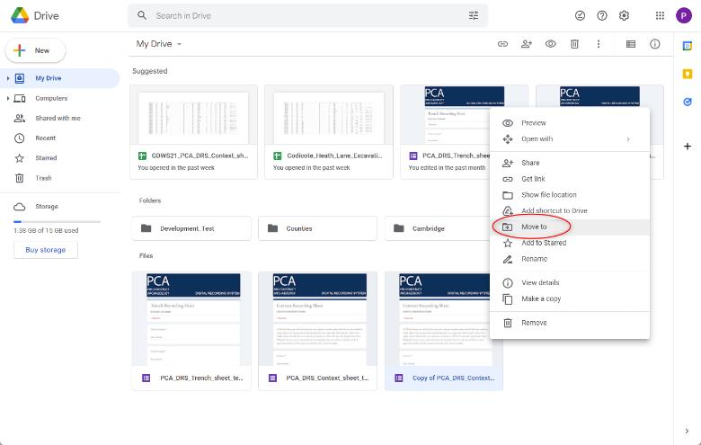
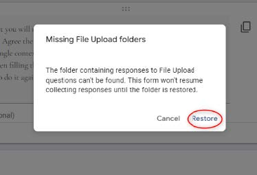

.. Purpose: This chapter aims to describe how the user starts to use QGIS. It
.. should be kept short with only few steps to get QGIS working with two layers.

.. _`label.getstarted`:

***************
DRS Initial Configuration
***************

.. only:: html

   .. contents::
      :local:

This chapter provides a quick overview of how to configure the DRS fon Cloud and tablets for  a new project.

.. index:: Installation
.. _`label_installation`:

Configuring a new folder on the cloud DRS storage account
----------------------

The current DRS data is stored in a main Google Drive account. 
.. note:: 
	Contact geospatialdata@pre-construct.com for the credentials.	

The internal folder structure of Google Drive is the same as that used on the local server project folder, with a subdivision in counties, towns and sites.

Create a new Project folder for your project. If a subdivision in areas is planned, consider using the same subdivision in the folder structure.

Right-click on the DRS Form template located in the home and select Make a copy

|DRS_conf_001|

Go to your project folder and rename your copy of the Form template with your Site Code and Site Name (e.g., LNDBKP22_London_Buckingham_Palace_PCA_DRS_Trench_sheet or LNDBKP22_London_Buckingham_Palace_PCA_DRS_ Context _sheet)

Open the form. When the Form is being opened for the first time, a message will appear asking to restore the Missing File Upload folders.

Those are the folders where the images used as attachments (e.g., sketches or feature overview photos) will be stored.

Press Restore to allow Google to automatically create the required subfolder structure.

|DRS_conf_002|

			

   
