.. Purpose: This chapter explains how to set up a new DRS project.
.. It should be kept short, with only the essential steps needed to configure the cloud files and tablets.

.. _`label.getstarted`:

*********************
DRS Project Setup
*********************

This chapter explains how to set up a new DRS project, including the cloud storage, Google Form, Google Spreadsheet and site tablets.

The DRS setup consists of three main components:

* A project folder in Google Drive.
* A Google Form used for data collection.
* A Google Spreadsheet used to store and review the submitted data.

Creating the Project Folder
---------------------------

The current DRS data is stored in a main Google Drive account.

.. note::
   Contact geospatialdata@pre-construct.com to obtain the required credentials.

1. Open the main Google Drive DRS account.

The internal folder structure of Google Drive is the same as that used on the local server project folder, with a subdivision in counties, towns and sites.

2. Create a new project folder for your project. If a subdivision into areas is planned, consider using the same subdivision in the folder structure.

3. Right-click on the DRS Form template located in the home folder and select **Make a copy**.

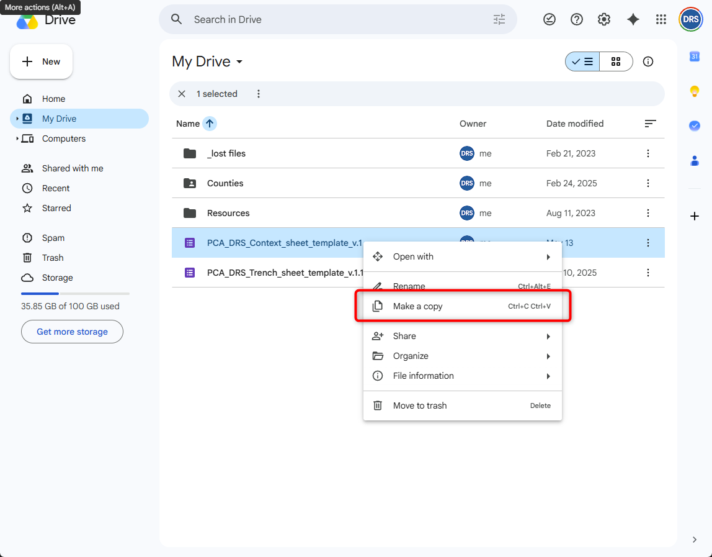

4. Move your copy into the project folder. Right-click on the form and select **Move to**.

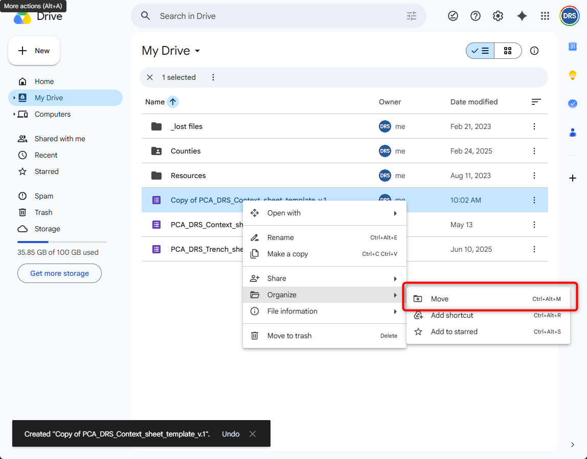

5. Go to your project folder and rename your copy of the Form template with your Site Code and Site Name, for example *LNDBKP22_London_Buckingham_Palace_PCA_DRS_Trench_sheet* or *LNDBKP22_London_Buckingham_Palace_PCA_DRS_Context_sheet*.

Setting Up the Form and Spreadsheet
-----------------------------------

6. Open the Form. When the Form is opened for the first time, a message will appear asking you to restore the *Missing File Upload folders*.

These are the folders where images used as attachments, such as sketches or feature overview photos, will be stored.

7. Press **Restore** to allow Google to automatically create the required subfolder structure.

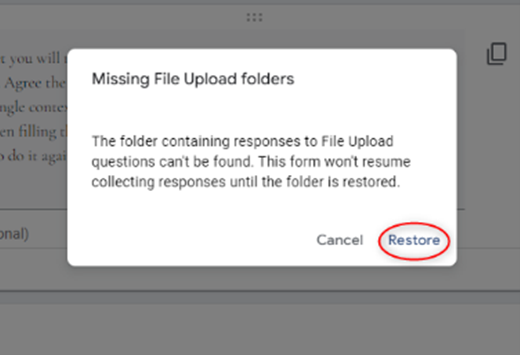

8. In the top part of the Form, add your SITECODE and SITENAME.

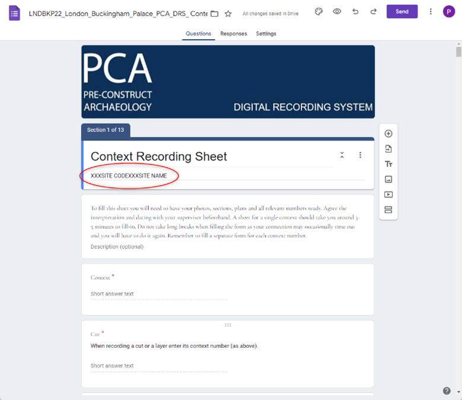

**The Form is now ready.** The next step is to create the associated Google Spreadsheet that will collect all the data generated by the Form.

9. On the Form, select the **Responses** tab and click on the Spreadsheet icon.

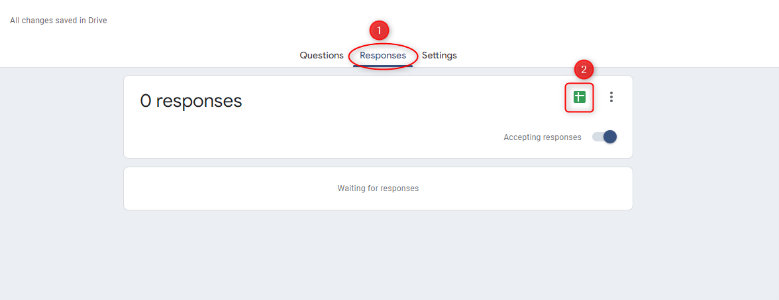

10. In the pop-up window, check that the first option is selected, *Create a new spreadsheet*, and click on **Create**.

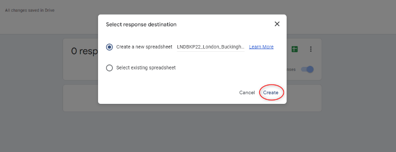

The files are now ready on the main Google Drive account. They need to be sent or shared so they can be used on site tablets.

Setting Up the Tablets
----------------------

Sending the Form to Tablets
~~~~~~~~~~~~~~~~~~~~~~~~~~~

11. As people on site need to be able to fill out the Form but not modify it, send them an invitation to fill out the Form.

On the open Form, click on **Publish**.

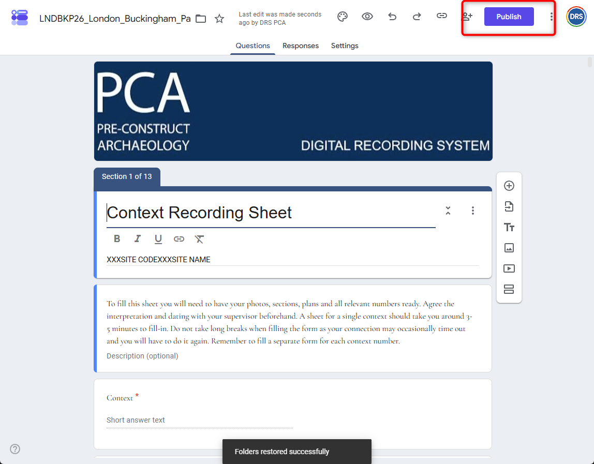

In the pop-up window, click **Publish** again to confirm.

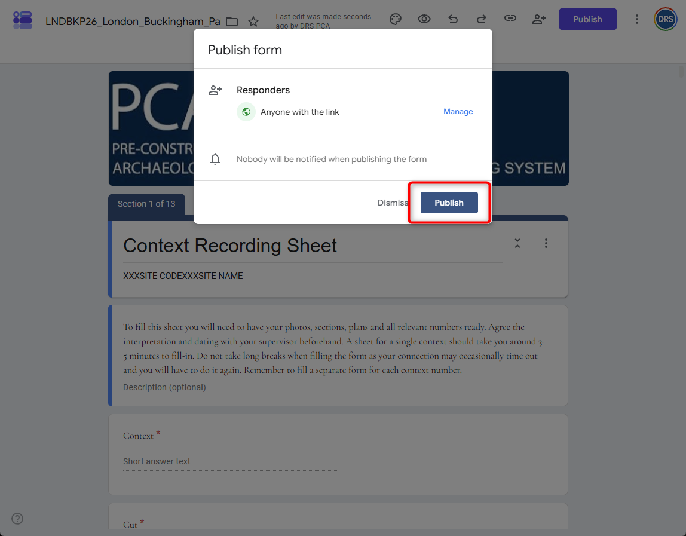

After this, the status of the Form will change to **Published**. You can now share it by pressing the sharing icon on the left of the Published status.

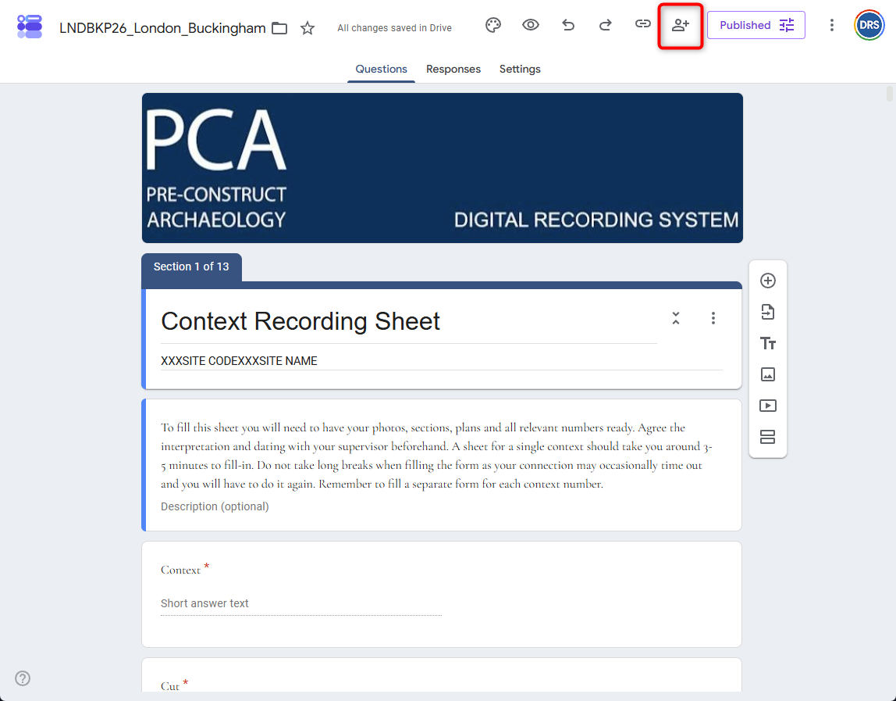

In the pop-up window, add the tablet Google account email address (1). Multiple email addresses can be added at the same time. Check that the status *Responder* (2) is unchecked and then press **Send**.

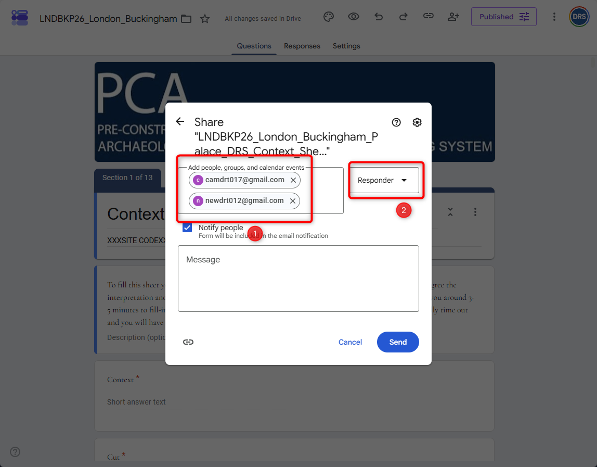

12. On the tablet, open Gmail to access the received email and click on **Fill out Form** to open it in the browser.

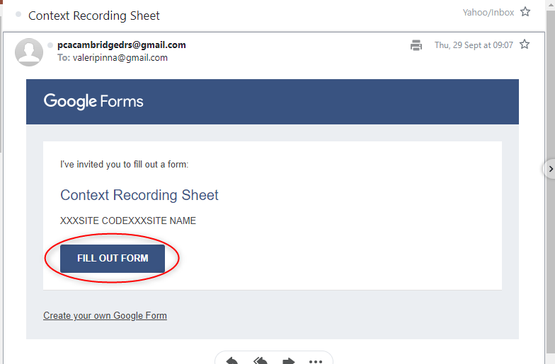

On the browser, usually Google Chrome, the open Form can be added as a bookmark on the home screen for quick access.

To create a bookmark, press the three dots icon in the top-right corner and select **Add to Home screen**.

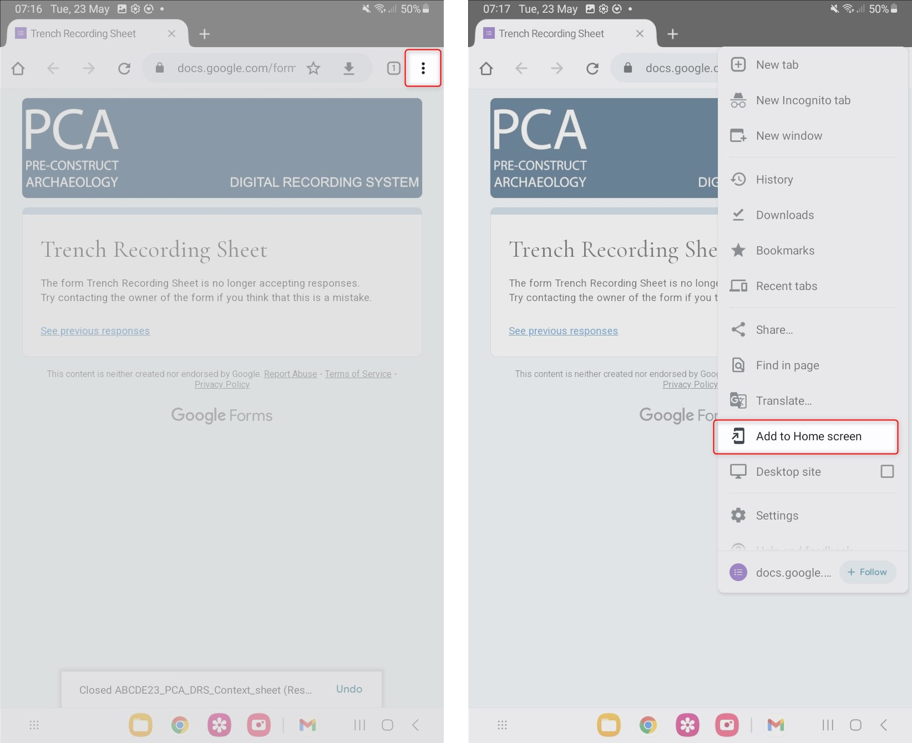

Confirm the operation by pressing **Add** in both dialogues that appear.

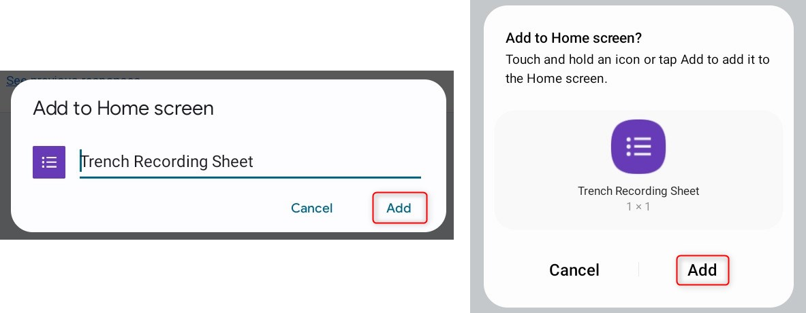

The bookmark will now be available on the home screen.

Sharing the Spreadsheet with Tablets
~~~~~~~~~~~~~~~~~~~~~~~~~~~~~~~~~~~~

13. Unlike the Form, the Spreadsheet may need to be reviewed, commented on, or corrected. For this reason, it is shared directly with tablet users.

Open the Spreadsheet and click on **Share**.

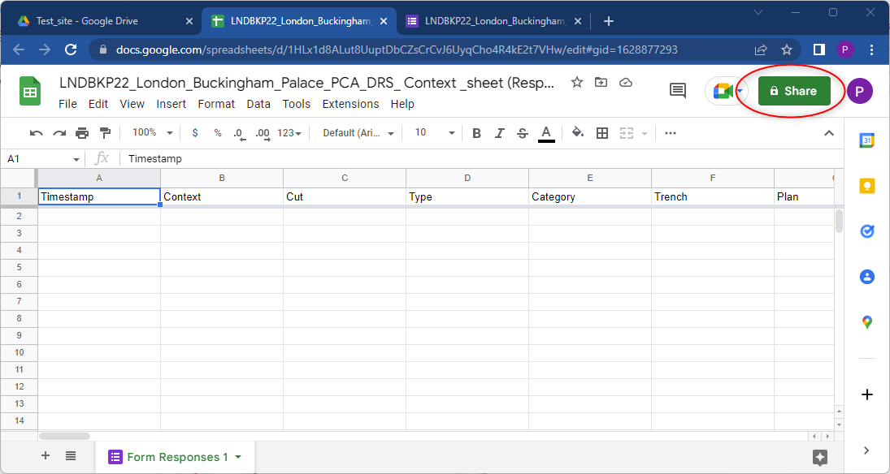

In the pop-up window, click on **Add people and groups** and add the tablet Google account.

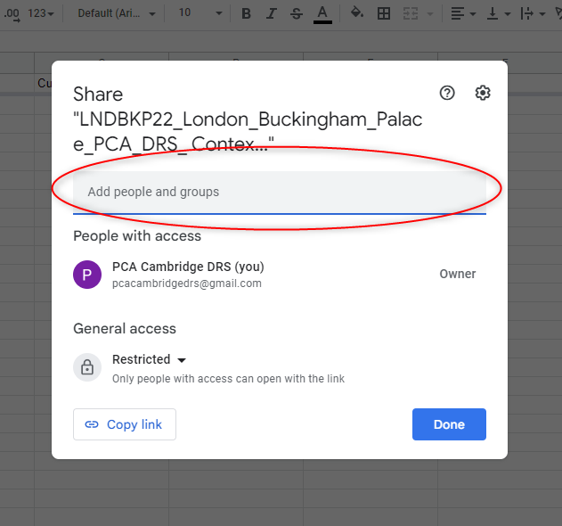

A new window will open. Here you can define the permission level that you want to give to the tablet account.

Click on **Editor** and select the required option.

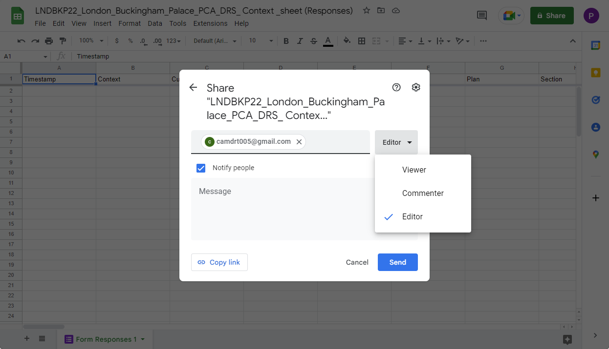

   - A Viewer can only see the Spreadsheet.

   - A Commenter can add comments but cannot edit the Spreadsheet.

   - An Editor can see comments and edit the Spreadsheet.

Usually, all tablets need at least Commenter permission to allow users to add comments and request corrections or amendments to data inserted through the Form.

Only one tablet, used by the PO or Supervisor, will normally have Editor permission to allow corrections.

Configure the sharing according to the chosen strategy and press **Send** to share the Spreadsheet.

Repeat the operation for all tablets in use on site.

14. On the tablet, open Gmail to access the shared Spreadsheet.

The procedure to create the bookmark on the home screen is slightly different from the one used for the Form.

This is because the Spreadsheet will normally be accessed using the dedicated Google Sheets app. However, to create the bookmark, it is necessary to open the link manually in Chrome.

On Gmail, open the received email, then press and hold **Open** to open the options dialogue. Select **Copy URL**.

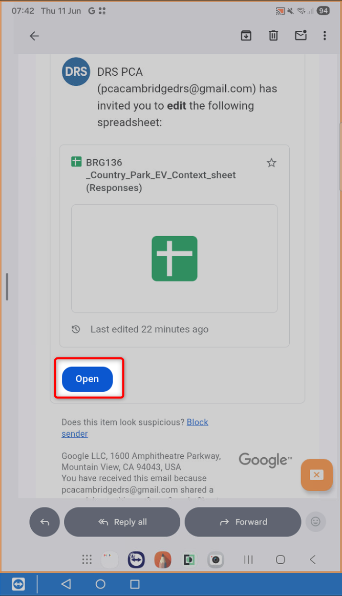

Open Google Chrome and paste the address into the browser address bar (1). Then press the three dots icon (2) in the top-right corner and select **Add to Home screen**.

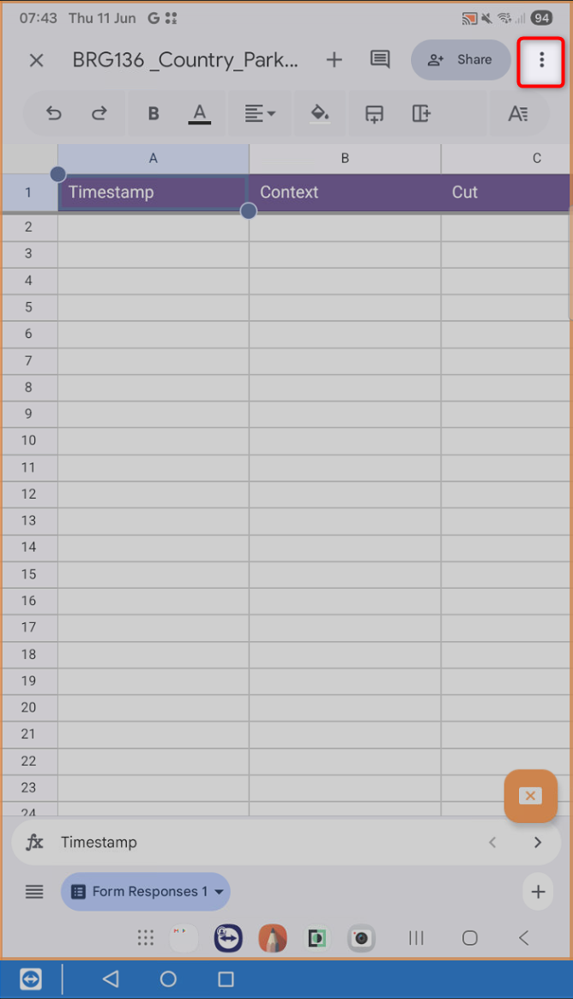

This operation will create the bookmark on the home screen.

Finally, if available, press **Use the app** in the bottom-right corner to view the Spreadsheet using Google Sheets.

.. note::
   This last step will appear only the first time. If you have already selected this option before, you can ignore this step.

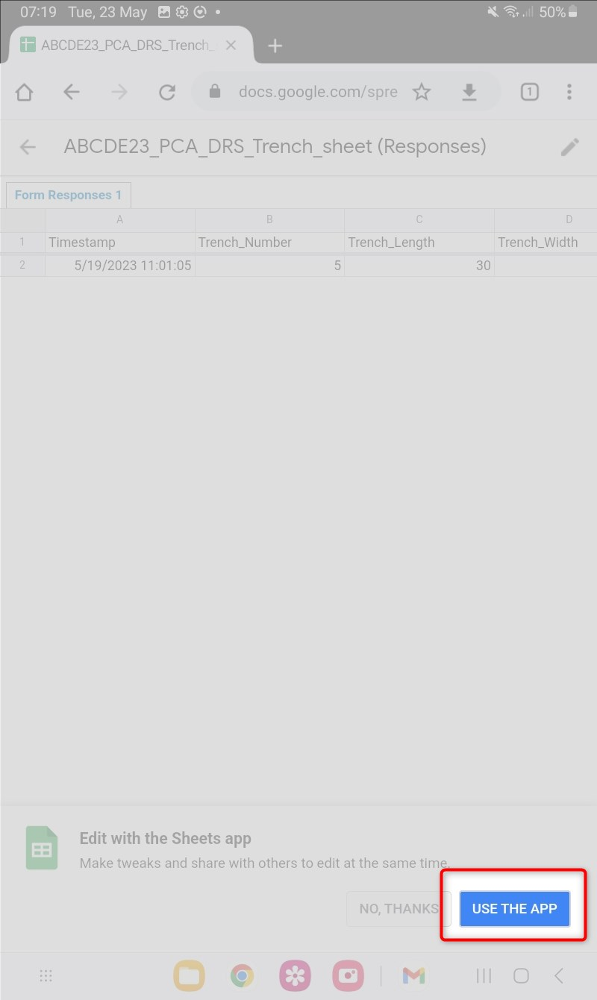