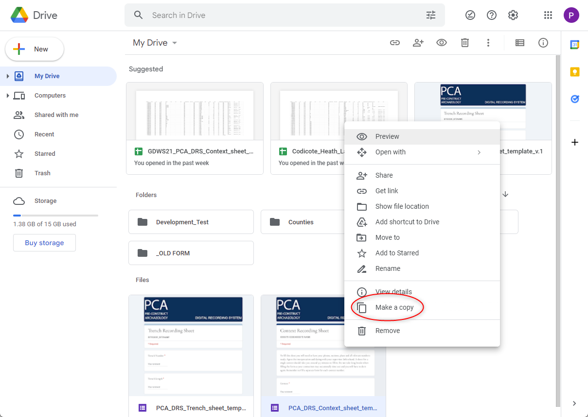
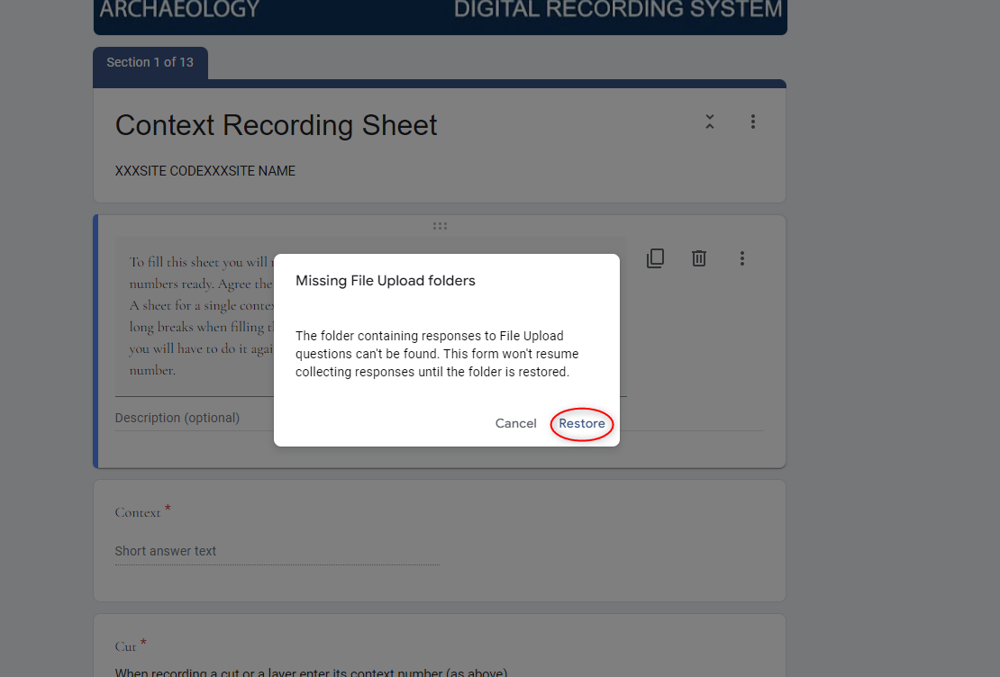
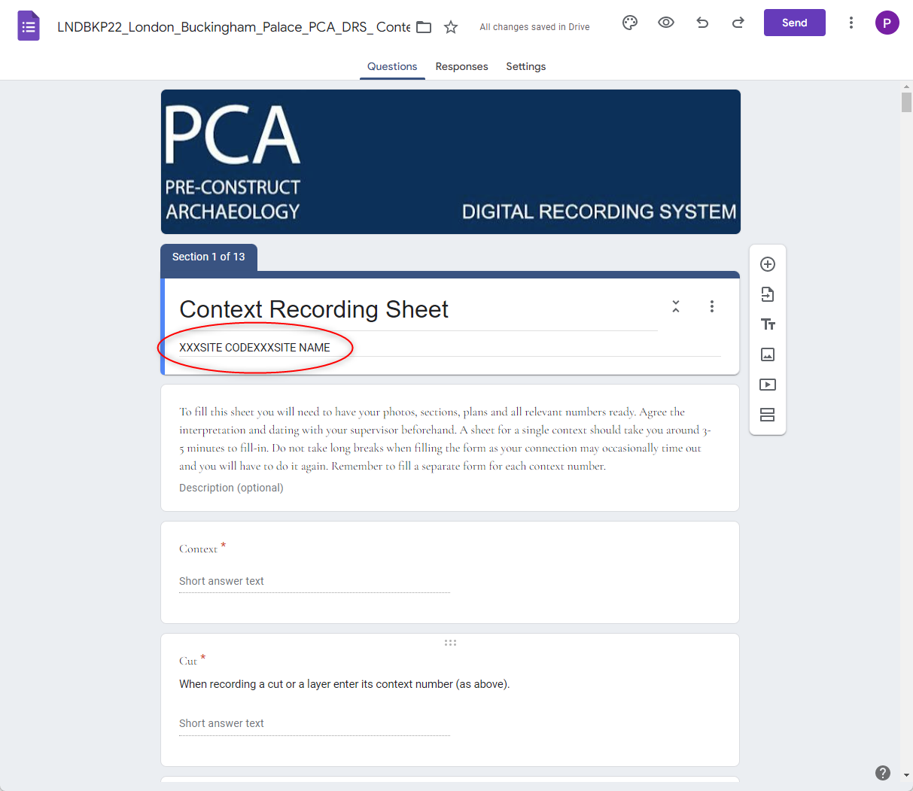
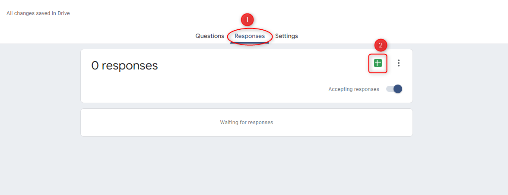
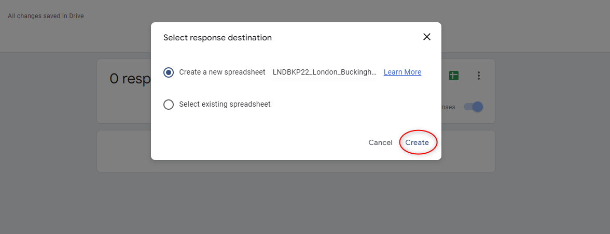

.. Purpose: This chapter aims to describe how the user starts to use QGIS. It
.. should be kept short with only few steps to get QGIS working with two layers.

.. _`label.getstarted`:

***************
DRS Initial Configuration
***************

This chapter provides a quick overview of how to configure the DRS fon Cloud and tablets for  a new project.

Configuring a new folder on the cloud DRS storage account
----------------------

The current DRS data is stored in a main Google Drive account. 

.. note:: 
   Contact geospatialdata@pre-construct.com for the credentials.
   
1. Open Google Drive DRS main account.

The internal folder structure of Google Drive is the same as that used on the local server project folder, with a subdivision in counties, towns and sites.

2. Create a new Project folder for your project. If a subdivision in areas is planned, consider using the same subdivision in the folder structure.

3. Right-click on the DRS Form template located in the home and select **Make a copy**

4. Move your copy into the project folder. Right-click on the form and select **Move to**

.. image:: images/DRS_initial_configuration_002.png
   :width: 600
   :align: center

5. Go to your project folder and rename your copy of the Form template with your Site Code and Site Name (e.g., *LNDBKP22_London_Buckingham_Palace_PCA_DRS_Trench_sheet* or *LNDBKP22_London_Buckingham_Palace_PCA_DRS_Context _sheet*)

Configuring the Google Form and the Google Spreadsheet
----------------------

6. Open the form. When the Form is being opened for the first time, a message will appear asking to restore the *Missing File Upload folders*.

  Those are the folders where the images used as attachments (e.g., sketches or feature overview photos) will be stored.

7. Press **Restore** to allow Google to automatically create the required subfolder structure.
   

8. In the top part of the Form, add your SITECODE and SITENAME.

**The form is now ready**. The next step is to create the associated Google spreadsheet that will collect all the data generated by the form.

9. On the form, select the tab Responses and click on the Spreadsheet icon

10. In the new popup window check that the first option is selected (*Create a new spreadsheet*) and click on **Create**.

Our files are now ready on the main Google Drive account. They need to be sent or shared to be used on site on the tablets.

Configuring the tablets
----------------------

Sending the Google Form to the tablets
~~~~~~~~~~~~~~~~~~~~~~~~~~~~~~~~~~~~~~

11. As we want people on site to be able to fill out the form, but not modify it, we just send an email an invitation to fill out the form.
On the open form, click on **Share**.

On the new opened popup window, add the tablet Google account email (1) (it is possible to add more than one email for time). Check that the option *Include form in email* (2) is unchecked and then, press **Send** (3)

On the tablet, open the received email and click on *Fill out Form* to open it on the browser.

   
On the open form, send the page as a bookmark on the home screen to have quick access to it.

Sharing the Google Spreadsheet with the tablets
~~~~~~~~~~~~~~~~~~~~~~~~~~~~~~~~~~~~~~~~~~~~~~~

12. Unlike before, we want people to be able to access the table for comments and changes.
In this case, therefore, instead of sending a link, we will share the table with the tablet Google account.
Open the Spreadsheet and click on Share
In the new popup window Click on Add people and groups and add the tablet Google Account.
A new window will open. Here you can define the level of permit that you want to give to the tablet’s account. Click on Editor and select the desired option.
A Viewer can only see the spreadsheet.
A Commenter can add comments but can’t edit the spreadsheet.
An Editor can see the comments and edit the spreadsheet.
Usually, all the tablets need at least Commenter permits to allow people to add a comment to request a correction or an amendment on the data they inserted through the form.
Only one tablet, used by the PO/Supervisor, will have Editor permits to allow corrections.
Configure the sharing according to the chosen strategy and press Send to share the spreadsheet.
Repeat the operation for all the tablets in use on-site.
On the tablet, open Google Drive to access the shared copy of the spreadsheet and create a bookmark on the home screen to generate quick access to it.   
   
   
   
   
   
   
   
   
   
   
   
   
   
   
