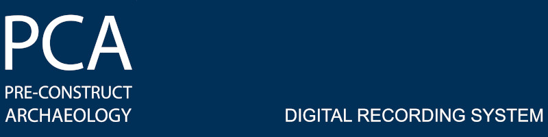

.. _DRS-manual-index-reference:

|DRS_logo|

Digital Recording System Guides and Tutorials
=============================================

The PCA Digital Recording System (DRS) enables archaeological data to be recorded directly in the field using mobile devices such as tablets and smartphones. Data entered through the DRS is automatically stored in Google Spreadsheets, providing immediate access to records without the need for manual database entry during post-excavation.

As part of PCA's integrated GIS workflow, DRS records are linked directly to site plan data and are therefore available for review, analysis and mapping as soon as they are submitted. Updates are synchronised across the project environment, including GIS projects and Mergin workspaces where applicable.

The current DRS platform is based on Google Forms and includes a comprehensive range of recording sheets, from standard Context records to specialist forms such as Cremation, Skeleton, Masonry and Timber records. The form adapts dynamically to the information entered by the user, displaying only the questions relevant to the selected feature type and category.

A dedicated form is also provided for Trench recording.

While archaeological records are captured digitally, project registers currently remain paper-based due to limitations of the Google Forms platform.

.. important::

   A dedicated PCA DRS web application is currently under development and will provide a fully integrated digital recording environment, addressing the limitations of the current Google Forms implementation.

.. toctree::
    :maxdepth: 2
    :numbered: 4

    drs_configuration/DRS_initial_configuration
    project_data_structure/project_data_folder_structure

