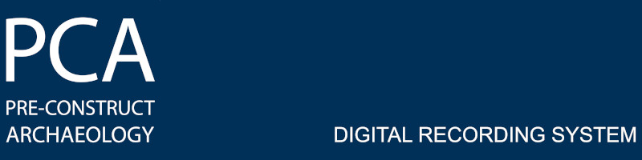

.. _DRS-manual-index-reference:

|DRS_logo|

Digital Recording System Guides and Tutorials
===============

One of the key elements of PCA's integrated GIS system is represented by the digital data recording system (DRS) which allows all archaeological data to be recorded directly in the field in digital format.
The current configuration of the PCA DRS is based on a simple Google Form accessible by mobile devices (tablets and phones). 
All the data inserted are automatically (and instantly) converted into a spreadsheet record.

In addition to eliminating the need to manually compile a database in the post-excavation phase, the recorded data is immediately available on the GIS project (and on Mergin)  and, being linked to the site plan data, they can be managed, edited and interrogated.

Currently, the PCA Digital Recording System comprises all the sheets, from the context sheet to the specialistic sheets (cremation sheet, skeleton sheet, masonry sheet, timber sheet), all available in the same form, which, based on the basic answers provided (type, category), adapts automatically, showing specific questions available for the type of feature registered.
A dedicated form covers the Trench sheet. 

In the current DRS configuration, all the registers are still in paper format. This limitation depends on the current Google Form solution.

.. important:: A dedicated PCA DRS web application is currently under development and it will solve all the current limitations.  

.. toctree::
    :maxdepth: 2
    :numbered: 4

    drs_configuration/DRS_initial_configuration
	
    

   
