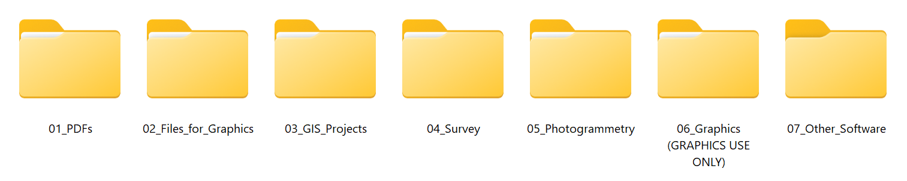
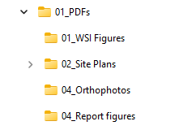
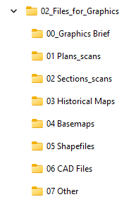
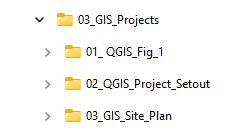
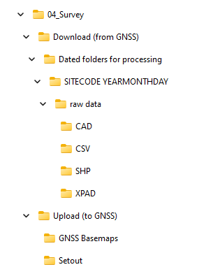
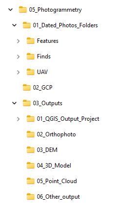

.. _`label.getstarted`:

***************
Project Data Folder Structure
***************

This chapter provides a quick overview of the new Project Data folder structure.

Introduction
----------------------

The introduction of the new PCA geospatial data recording and management system required a different approach to data storage.

A good data organization in folders and subfolders, together with consistency in the data storage location (and file names!) is an indispensable requirement to ensure the functioning of an integrated system.

Moreover, compliance with the rules of a shared data storage system drastically reduces the time of data management (finding a file correctly named in the correct folder saves a lot of time) and allows the use of automated processes for data processing.

The new Project data folder structure is a container for all the geospatial data generated during all the phases of a project, from the project set out to the final graphical outputs.

As can be seen in the figure below, all folders are named in a self-explanatory way and pre-numbered to keep the order of the structure unaltered.

**************

01_PDFs
~~~~~~~~

01_PDFs contain all the produced PDFs (site plans processed survey, WSI figures, orthophotos outputs, etc....).

There are already some predefined subfolders to facilitate organized storage, but, if necessary, you can create additional ad-hoc subfolders.

02_Files_for_Graphics
~~~~~~~~~~~~~~~~~~~~~

02_Files_for_Graphics is a container that each person involved (Manager, PO) can use to store the data they want to share with Graphics (for example, PDFs, images, shapefiles or CAD files for setouts or WSIs). 

Graphics will be responsible for moving the various files to the most suitable place depending on their use (e.g., GIS project folders).

There are already some predefined subfolders to facilitate organized storage, but, if necessary, you can create additional ad-hoc subfolders.

03_GIS_Projects
~~~~~~~~~~~~~~~~

03_GIS_Projects is the container for all the GIS projects, organized in subfolders. Some of the projects are for internal Graphics use only (*01_QGIS_Fig_1_Template* and *02_QGIS_Project_Setout*).

The subfolder 03_QGIS_Site_Plan contains the active site plan project and can be used by graphics, supervisors and managers.

For more specifications on this folder, you can refer to the dedicated guide.

04_Survey
~~~~~~~~~~

04_Survey contains all survey data, both incoming and outgoing.

*Download (from GNSS)* contains dated folders for processing, where all survey data (from raw data exported from GNSS/GPS to processed files) are organized into daily dated subfolders (for example, *XFRE22_220821*). It is primarily maintained by Graphics but is accessible to anyone involved to verify the raw survey data if necessary.

*Upload (from GNSS)* is the container for all the data prepared in the office by Graphics to be imported into GNSS.GPS.

Most of these files will also be available in the cloud so you can access them directly from your GNSS tablet.

05_Photogrammetry
~~~~~~~~~~~~~~~~~

05_Photogrammetry is the container for all the photogrammetric data, from the raw photos to the final outputs (e.g., orthophotos, Digital Elevation Models (DEM), 3D models). The parent folder contains the Agisoft Metashape project file.

01_Dated_Photos_Folders contains all the raw photos, organised in subfolders (*Features, Finds, UAV*).

02_GCP contains the ground control points .csv files.

03_Outputs is where all the photogrammetry outputs are saved. It is organised in subfolders for easier file management.
Here is also located a dedicated QGIS project used only for the conversion of orthophotos and DEMs to PDF.

   

06_Graphics (GRAPHICS USE ONLY)
~~~~~~~~~~~~~~~~~~~~~~~~~~~~~~~

06_Graphics (GRAPHICS USE ONLY), as his name suggests, is a folder for internal Graphics Dept use only. It contains all the processing data files used for the final figures output.

07.Other_Software
~~~~~~~~~~~~~~~~~~

07.Other_Software is a generic container for all the files generated by unusual software. Create a subfolder with the software name to keep the folder organised.
   
   
   
   
   
   
   
   
   
