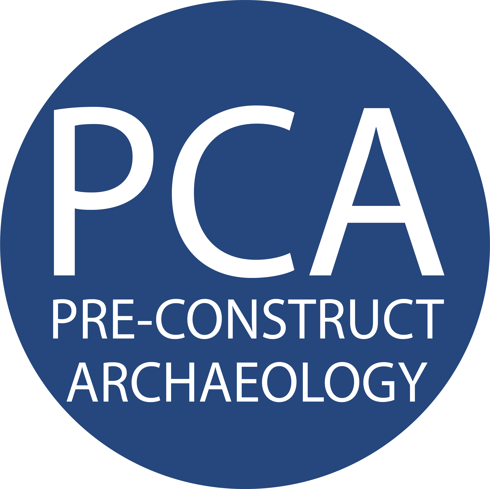

Welcome to PCA Geospatial Data documentation!
===================================

This documentation is intended to offer support on the different innovations introduced by the **PCA Geospatial Data Department** offering quick access to guides, tutorials (and video tutorials!!!).

The documentation is constantly updated and it can be viewed online or downloaded in PDF format (see below).

The decision to use a ReadtheDocs documentation style is and offers a *simple* and *intuitive* interface and to offer a collaborative space where everyone can add information and correct possible errors.

Check out the :doc:`usage` section for further information, including
how to :ref:`installation` the project.

.. attention::

   This project is currenlty under active development and is to be consider not stable.

Contents
--------

.. toctree::

   general
   qgis_plugins
   mergin

QGIS
--------

.. toctree::
   mergin
   
   
Digital Recording System
--------

.. toctree::
   mergin

   
