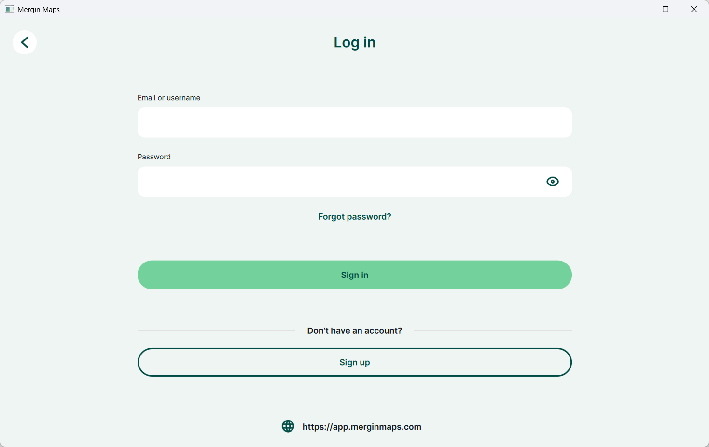
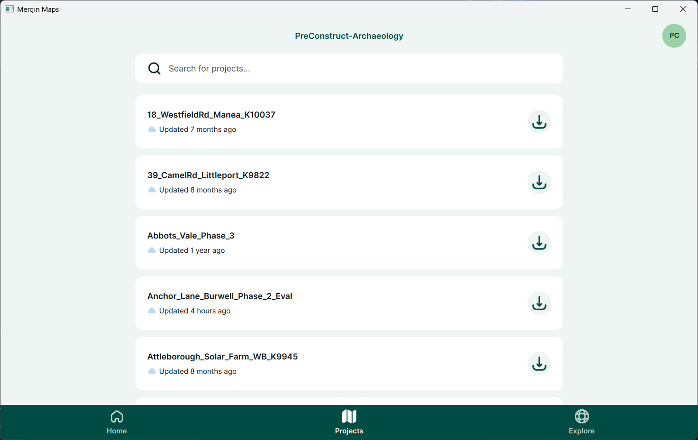
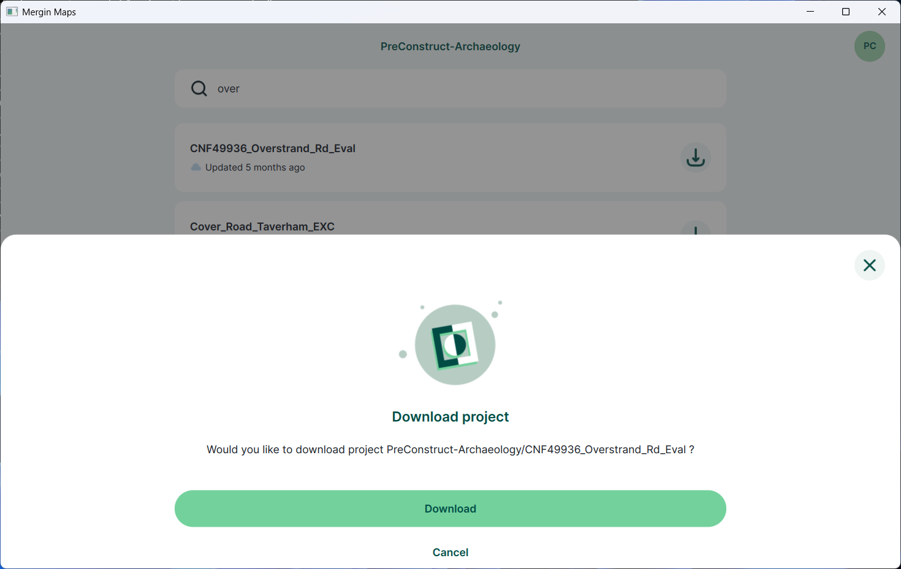
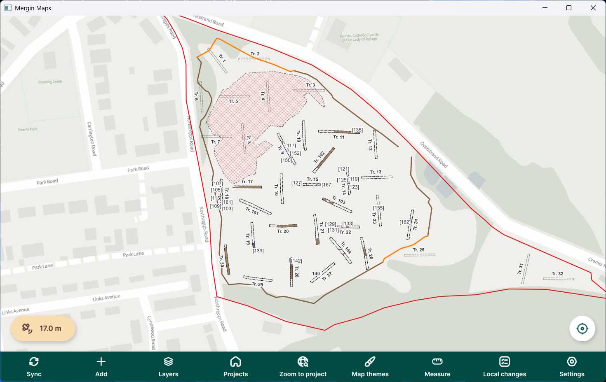

Open a Project
==============

Overview
--------

This guide explains how to download and open a project in Mergin Maps.

Before you begin
----------------

* You have a PCA Mergin Maps account.
* Your device has an internet connection.

Steps
-----

#. Open **Mergin Maps**.
#. Sign in if prompted.

#. Open the **Projects** tab.

#. Tap the required project.

#. If the project is not already on the device, tap **Download**.

#. Wait until the download completes.

#. Tap the project name to open it.

   Placeholder – Project opened successfully.

Result
------

The project is ready for use.

.. note::

   Downloading a project only needs to be done once. Afterwards simply tap the
   project name to open it.
