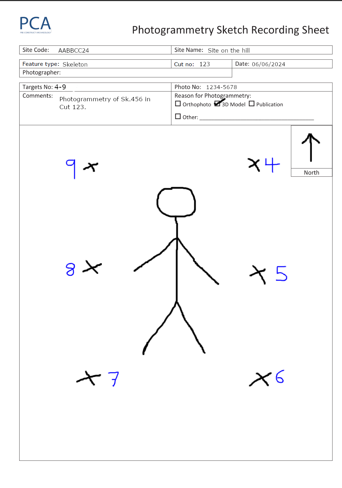
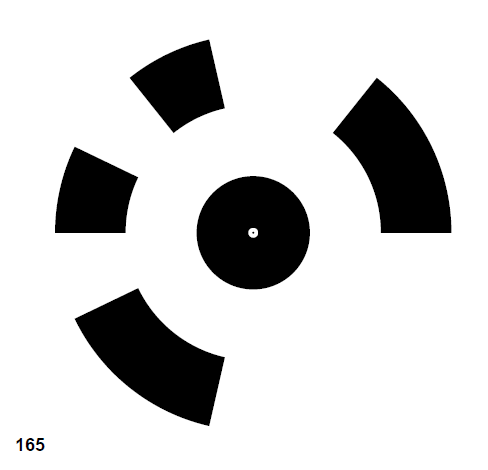
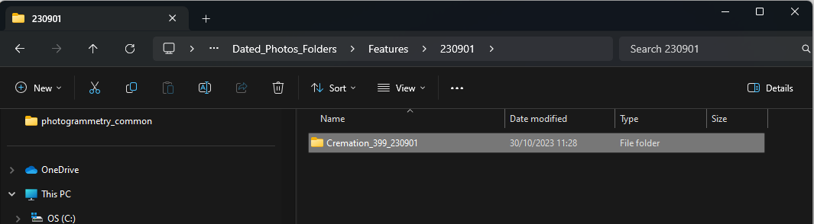

Site Photogrammetry
===================

.. note:: 
    This chapter focuses on the process of recording photogrammetry on-site.
    

Preparation
------------

1. Before taking photos, ensure you have the following equipment ready: 
    * Photogrammetry sheet
    * Suitable camera
    * GPS device
    * Targets (Agisoft or others)
    * Small nails
    
2. Make sure the area around your subject is clean and free of obstructions.
    This will ensure a more accurate depiction.

Targets
--------

3. Arrange your targets in a box shape around the subject.
   Avoid arranging your targets in a irregular shape around the subject - they should be arranged in-line with one another.
   
4. If using agisoft circular coded targets, avoid nailing them through the image. Nail them into the ground at the corners.
	|Photogrammetry_target|

.. note::
	Dont reuse agisoft targets. Each one has a unique pattern and number to be identifiable from the others.
	
Recording your job
------------------
    
5. Complete your photogrammetry sheet.
    Your sheet should have a simple sketch, with a north arrow and the location and number of your targets.
	Fill in the rest of the information accordingly. 
	
|Photogrammetry_sheet|

	
.. note::
    When filling out the photo numbers, wait until you've finished photographing, then write the final number onto the sheet.

6. Begin by photographing your photogrammetry sheet.
   This will allow the processor to know where your images begin.	

	
Photogrammetry recording
------------------------

The process of taking photogrammetry is divided into separate steps. 
Each step will provide different information of the subject to help create a more accurate output.

7. At standing height, rotate around your subject 360 degrees - taking a photo each step.
	Ensure the subject is at the central point of each photo and that any photo overlaps about 50% with the previous photo.

8. Repeat step 6 but in a crouched position, doing another 360 around your subject.
	At this point you would've done 2 circles around your subject at different elevations.

9. Next, take plane shots of the subject in a grid/transect pattern. Try to move only in one direction, e.g feet to head, until your subject has enough coverage.

.. note::
    For example, with a skeleton, start from the feet and move up the body, taking plan shots. Repeat this three times to cover the right, center, and left sides of the body, starting from the feet each time.
    
10. Then, repeat step 9 in the other direction (moving left to right) until the subject is covered.
    Steps 9 and 10 together should create a crosshatch pattern, forming a mosaic of plan photos of the subject.

11. Now, to add details, take close up photos in areas that may require more coverage or perhaps the previous steps didnt capture.
	Try not to use the zoom and instead move closer to the area.

12. Once satisfied, take a zoomed-in and zoomed-out photo of each target. 
	
	
13. Conclude by taking a final photo of your photogrammetry sheet.
	This will let the processor know where your photos start and finish. 
	
	
Record the targets
-------------------

14. Once happy with the photo results, survey the targets as soon as possible and write their associated number into the attribute box.
	Make sure they are not moved before being surveyed. 

15. Export the job with the targets with a name to identify their are targets in the job. e.g 01-01-2024-targets

Photo Upload
-------------

16. Upload the photos to the server as soon as possible for processing to begin.
	Use the Project folder/Photogrammerty/Dated_photo_folders/ and create a folder with the title of the job e.g Dated_Photo_Folders/Features/220518/Room3 postex 220518

	|Photogrammetry_file_upload|

	
