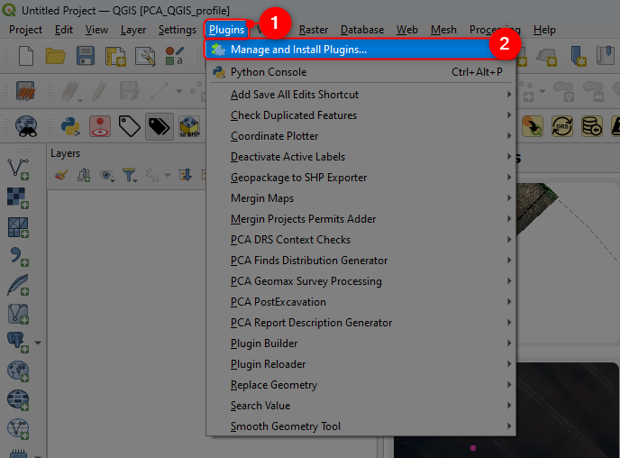
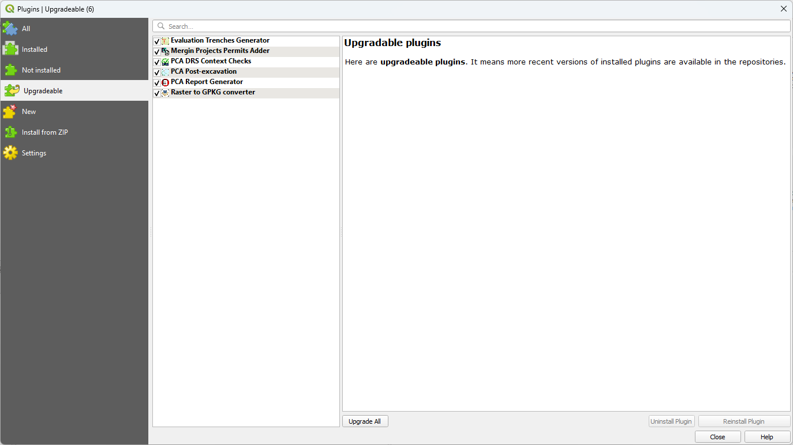
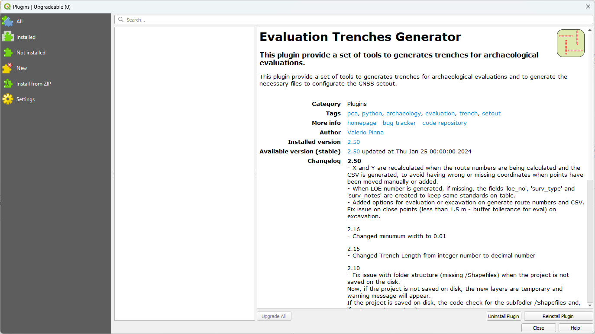

QGIS Plugins
=============

Updating plugins
----------------

1. Open QGIS an navigate to the Plugins Menu

2. Click on "Manage and Install Pugins"

   
3. This will open the "Plugins" window, navigate to the "Upgradeable tab" - you will see a list of all your plugins that are updateable

4. Click "Upgrade All"

   
5. After your plugins update, you'll no longer see the "Upgradeable" tab in the menu. This means all your plugins are up to date.

   