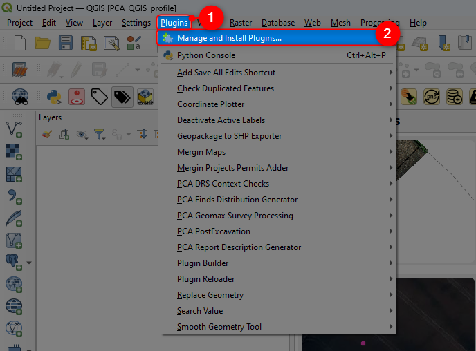
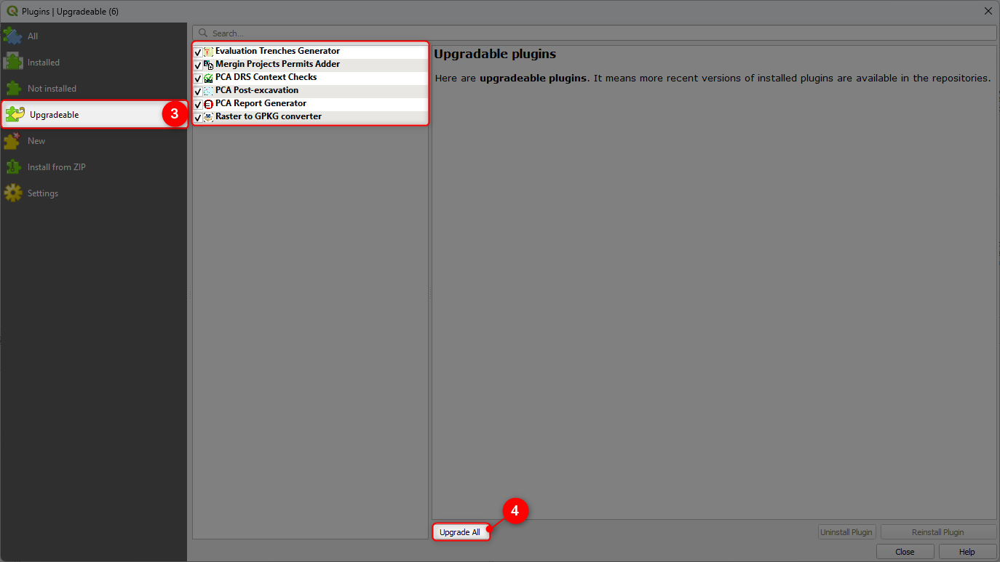
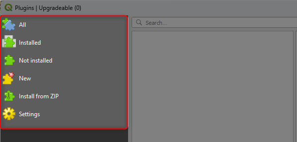

QGIS plugins
============

PCA maintains a growing collection of QGIS plugins designed for archaeological
survey, data quality, field recording, post-excavation and day-to-day GIS
production. This page provides a concise overview of the currently available
tools and their compatibility.

.. note::

   PCA plugins are distributed through the internal PCA QGIS plugin repository.
   Use the PCA QGIS profile wherever possible so that the repository and related
   settings are configured automatically.

Keeping plugins up to date
--------------------------

Keeping plugins current ensures that you receive bug fixes, workflow
improvements and compatibility updates for supported QGIS versions.

#. Open QGIS and select :menuselection:`Plugins --> Manage and Install Plugins`.
#. Open the :guilabel:`Upgradeable` tab. This tab is only visible when updates
   are available.
#. Review the available updates and select :guilabel:`Upgrade All`.
#. When the update is complete, restart QGIS if prompted.

.. tip::

   If the :guilabel:`Upgradeable` tab is not shown, all installed plugins are
   already up to date.

Plugin directory
----------------

The catalogue below is based on the current PCA plugin repository metadata.
Compatibility labels describe the versions advertised by each plugin package.

.. container:: plugin-card

   .. image:: images/icons/raster-to-gpkg-converter.png
      :alt: Raster to GPKG Converter icon
      :width: 64px
      :class: plugin-icon

   **Raster to GPKG Converter**

   .. container:: plugin-meta

      ``v2.00``  |  ``Raster``  |  ``QGIS 3.10–4.x``  |  ``Qt 5/6``

   Converts raster datasets to GeoPackage raster layers and builds pyramids for faster display.

   `Project or support page <https://github.com/PCA-Geodata>`__

.. container:: plugin-card

   .. image:: images/icons/pca-geomax-survey-processing.png
      :alt: PCA Geomax Survey Processing icon
      :width: 64px
      :class: plugin-icon

   **PCA Geomax Survey Processing**

   .. container:: plugin-meta

      ``v3.04``  |  ``Survey``  |  ``QGIS 3.10–4.x``  |  ``Qt 5/6``

   Processes PCA survey data using the Geomax code-list workflow and supports DRS/GIS integration.

   `Project or support page <https://github.com/PCA-Geodata/PCA_Geomax_Survey_Processing_QGIS_Plugin>`__

.. container:: plugin-card

   .. image:: images/icons/evaluation-trenches-generator.png
      :alt: Evaluation Trenches Generator icon
      :width: 64px
      :class: plugin-icon

   **Evaluation Trenches Generator**

   .. container:: plugin-meta

      ``v3.01``  |  ``Survey design``  |  ``QGIS 3.10–3.x``  |  ``Qt 5``

   Generates archaeological evaluation trenches and the files required for GNSS setting-out.

   `Project or support page <https://github.com/PCA-Geodata/Evaluation-Trenches-Generator-QGIS-plugin>`__

.. container:: plugin-card

   .. image:: images/icons/pca-post-excavation.png
      :alt: PCA Post-excavation icon
      :width: 64px
      :class: plugin-icon

   **PCA Post-excavation**

   .. container:: plugin-meta

      ``v4.03``  |  ``Post-excavation``  |  ``QGIS 3.10–4.x``  |  ``Qt 5/6``

   Manages groups, entities, periods, sub-periods and phases, updates related datasets, and prepares standardised exports.

   `Project or support page <https://github.com/PCA-Geodata/PCA-PostExcavation-QGIS-Plugin>`__

.. container:: plugin-card

   .. image:: images/icons/pca-drs-context-checks.png
      :alt: PCA DRS Context Checks icon
      :width: 64px
      :class: plugin-icon

   **PCA DRS Context Checks**

   .. container:: plugin-meta

      ``v3.00``  |  ``Quality control``  |  ``QGIS 3.10–4.x``  |  ``Qt 5/6``

   Runs checks against PCA DRS context records, including missing sheets, duplicate numbers and unmatched site-plan features.

   `Project or support page <https://github.com/PCA-Geodata/PCA-DRS-Context-Checks-QGIS-plugin>`__

.. container:: plugin-card

   .. image:: images/icons/search-value.png
      :alt: Search Value icon
      :width: 64px
      :class: plugin-icon

   **Search Value**

   .. container:: plugin-meta

      ``v2.05``  |  ``Navigation``  |  ``QGIS 3.10–4.x``  |  ``Qt 5/6``

   Searches layer attribute values, selects matching records and zooms directly to their geometries.

   `Project or support page <https://github.com/PCA-Geodata/Search-Value-QGIS-plugin>`__

.. container:: plugin-card

   .. image:: images/icons/pca-report-description-generator.png
      :alt: PCA Report Description Generator icon
      :width: 64px
      :class: plugin-icon

   **PCA Report Description Generator**

   .. container:: plugin-meta

      ``v2.00``  |  ``Reporting``  |  ``QGIS 3.10–4.x``  |  ``Qt 5/6``

   Creates draft archaeological descriptions from DRS records using templates for cuts, groups and individual context types.

   `Project or support page <https://github.com/PCA-Geodata/PCA-Report-Description-QGIS-Plugin>`__

.. container:: plugin-card

   .. image:: images/icons/pca-drs-context-sheet-printer.png
      :alt: PCA DRS Context Sheet Printer icon
      :width: 64px
      :class: plugin-icon

   **PCA DRS Context Sheet Printer**

   .. container:: plugin-meta

      ``v2.00``  |  ``Recording``  |  ``QGIS 3.10–4.x``  |  ``Qt 5/6``

   Generates clean, printable PDF sheets for context, trench, cremation and skeleton records using native QGIS layouts.

   `Project or support page <https://github.com/PCA-Geodata/>`__

.. container:: plugin-card

   .. image:: images/icons/check-duplicated-features.png
      :alt: Check Duplicated Features icon
      :width: 64px
      :class: plugin-icon

   **Check Duplicated Features**

   .. container:: plugin-meta

      ``v2.00``  |  ``Quality control``  |  ``QGIS 3.10–4.x``  |  ``Qt 5/6``

   Finds duplicated features using geometry and optional attribute checks, with tools to review or remove results.

   `Project or support page <https://github.com/PCA-Geodata/>`__

.. container:: plugin-card

   .. image:: images/icons/geopackage-to-shp-exporter.png
      :alt: GeoPackage to SHP Exporter icon
      :width: 64px
      :class: plugin-icon

   **GeoPackage to SHP Exporter**

   .. container:: plugin-meta

      ``v2.00``  |  ``Export``  |  ``QGIS 3.10–3.x``  |  ``Qt 5``

   Exports each spatial layer in a GeoPackage to a separate shapefile while excluding empty and non-spatial tables.

   `Project or support page <https://github.com/PCA-Geodata/>`__

.. container:: plugin-card

   .. image:: images/icons/add-save-all-edits-shortcut.png
      :alt: Add Save All Edits Shortcut icon
      :width: 64px
      :class: plugin-icon

   **Add Save All Edits Shortcut**

   .. container:: plugin-meta

      ``v1.03``  |  ``Editing``  |  ``QGIS 3.10–4.x``  |  ``Qt 5/6``

   Adds quick access to QGIS Save Edits for All Layers, reducing the risk of unsaved edits across multi-layer projects.

   `Project or support page <https://github.com/PCA-Geodata/>`__

.. container:: plugin-card

   .. image:: images/icons/mergin-projects-permits-adder.png
      :alt: Mergin Projects Permits Adder icon
      :width: 64px
      :class: plugin-icon

   **Mergin Projects Permits Adder**

   .. container:: plugin-meta

      ``v2.00``  |  ``Mergin Maps``  |  ``QGIS 3.10–3.x``  |  ``Qt 5``

   Adds and manages permitted Mergin Maps project folders in QGIS settings while preventing duplicate entries.

   `Project or support page <https://github.com/PCA-Geodata/PCA-Geodata.github.io>`__

.. container:: plugin-card

   .. image:: images/icons/pca-finds-distribution-generator.png
      :alt: PCA Finds Distribution Generator icon
      :width: 64px
      :class: plugin-icon

   **PCA Finds Distribution Generator**

   .. container:: plugin-meta

      ``v2.00``  |  ``Finds``  |  ``QGIS 3.10–3.x``  |  ``Qt 5``

   Creates finds-distribution layers from catalogues, with optional grouped summaries of quantities and weights.

   `Project or support page <https://github.com/PCA-Geodata/>`__

.. container:: plugin-card

   .. image:: images/icons/uk-national-grid-reference-finder.png
      :alt: UK National Grid Map Reference Finder icon
      :width: 64px
      :class: plugin-icon

   **UK National Grid Map Reference Finder**

   .. container:: plugin-meta

      ``v1.1.0``  |  ``Navigation``  |  ``QGIS 3.10–3.x``  |  ``Qt 5``

   Zooms to a UK National Grid Reference and temporarily highlights the resulting map location.

   `Project or support page <https://github.com/PCA-Geodata/>`__

.. container:: plugin-card

   .. image:: images/icons/pca-geometry-quality-control.png
      :alt: PCA Geometry Quality Control icon
      :width: 64px
      :class: plugin-icon

   **PCA Geometry Quality Control**

   .. container:: plugin-meta

      ``v1.30``  |  ``Quality control``  |  ``QGIS 3.10–4.x``  |  ``Qt 5/6``

   Scans project vector layers for null, empty and invalid geometries and provides tools to inspect and report problems.

   `Project or support page <https://github.com/PCA-Geodata/>`__

.. container:: plugin-card

   .. image:: images/icons/pca-data-source-explorer.png
      :alt: PCA Data Source Explorer icon
      :width: 64px
      :class: plugin-icon

   **PCA Data Source Explorer**

   .. container:: plugin-meta

      ``v1.10``  |  ``Project management``  |  ``QGIS 3.10–4.x``  |  ``Qt 5/6``

   Organises project data sources by location and type, identifies missing or external files, and reports duplicate sources.

   `Project or support page <https://github.com/PCA-Geodata/>`__

.. container:: plugin-card

   .. image:: images/icons/replace-clipped-geometry.png
      :alt: Replace Clipped Geometry icon
      :width: 64px
      :class: plugin-icon

   **Replace Clipped Geometry**

   .. container:: plugin-meta

      ``v2.00``  |  ``Editing``  |  ``QGIS 3.10–4.x``  |  ``Qt 5/6``

   Replaces feature geometry while preserving attributes, with native snapping, CAD support, live preview and optional clipping.

   `Project or support page <https://github.com/PCA-Geodata/>`__

.. container:: plugin-card

   .. image:: images/icons/pca-fieldwalk-grid-generator.png
      :alt: PCA Fieldwalk Grid Generator icon
      :width: 64px
      :class: plugin-icon

   **PCA Fieldwalk Grid Generator**

   .. container:: plugin-meta

      ``v1.10``  |  ``Survey design``  |  ``QGIS 3.10–4.x``  |  ``Qt 5/6``

   Builds British National Grid-aligned hectare and custom collection grids from a site boundary.

   `Project or support page <https://github.com/PCA-Geodata/>`__

.. container:: plugin-card

   .. image:: images/icons/pca-export-phased-features.png
      :alt: PCA Export Phased Features icon
      :width: 64px
      :class: plugin-icon

   **PCA Export Phased Features**

   .. container:: plugin-meta

      ``v1.02``  |  ``Post-excavation``  |  ``QGIS 3.10–4.x``  |  ``Qt 5/6``

   Exports Features_for_PostEx polygons into phased shapefiles with validation, preview and QA logging.

   `Project or support page <https://github.com/PCA-Geodata/>`__

Icon files
----------

All plugin icons used by this page are stored in one predictable location::

   qgis_plugins/images/icons/

The expected filename is shown in each image directive above. Placeholder icons
have been included for plugins that did not already have a local image. Replace
a placeholder with the final PNG while keeping the same filename; no RST change
will then be required. A square transparent PNG of at least 128 × 128 pixels is
recommended.

Maintenance notes
-----------------

When a plugin is added or updated, revise its version, compatibility label and
summary on this page at the same time as the repository metadata. Keeping the
page text concise makes the directory easier to scan and reduces duplication
with each plugin's full user guide.
