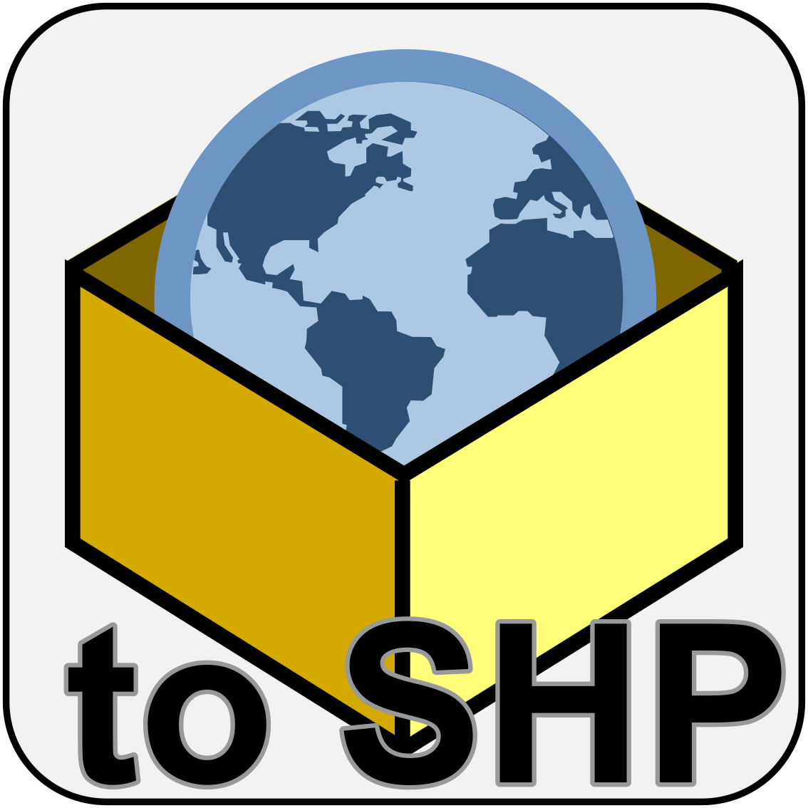
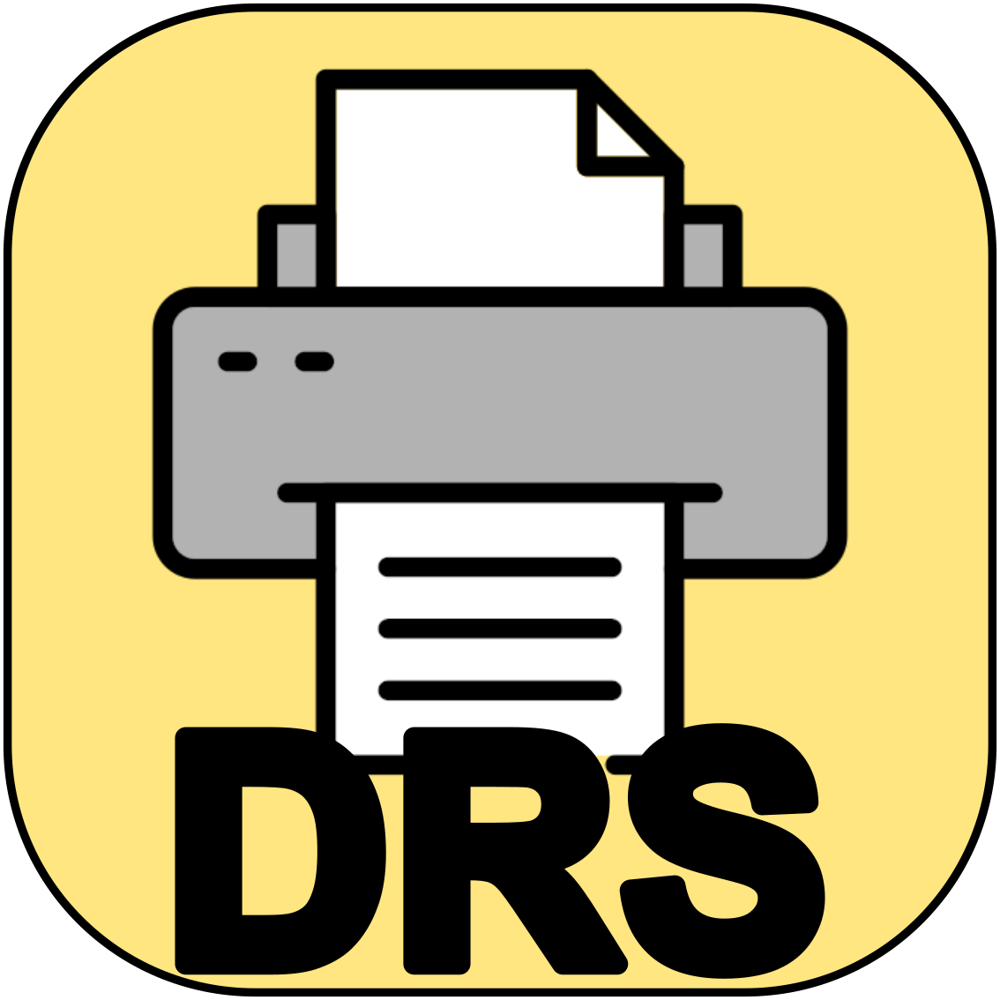
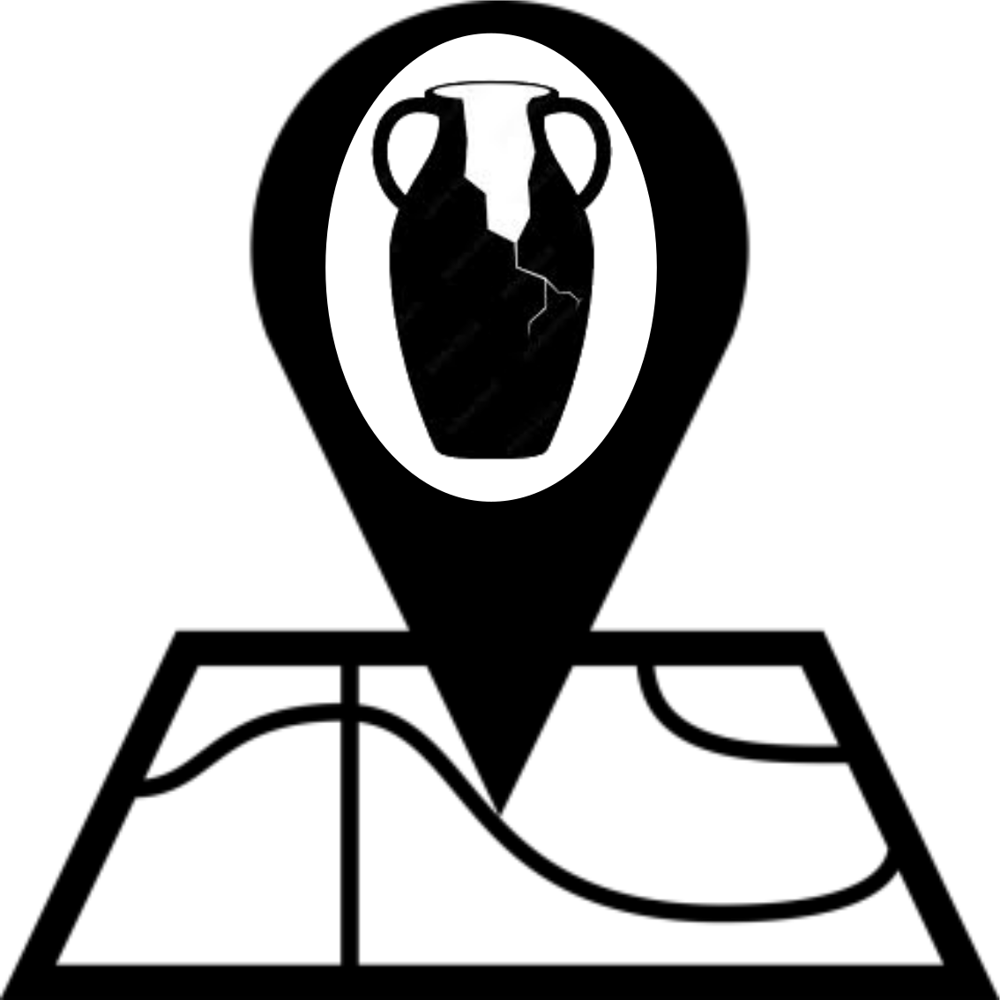
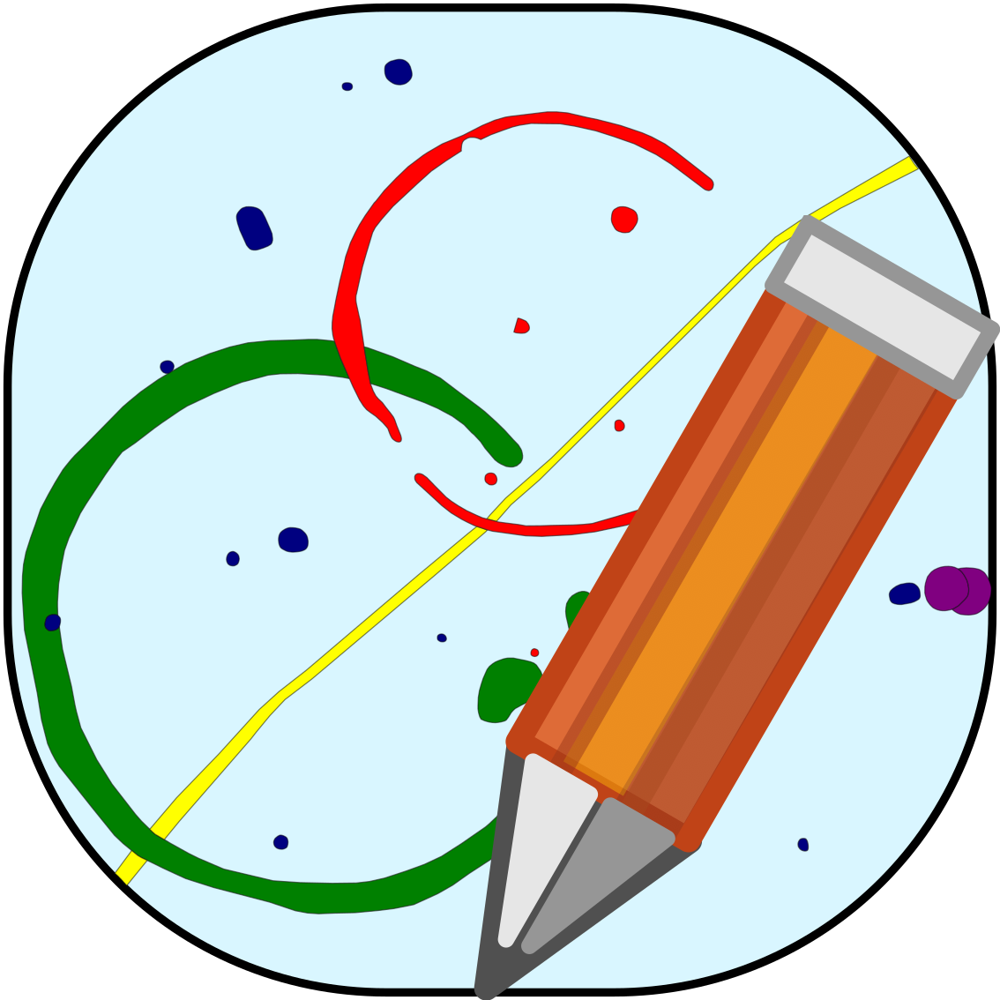

QGIS Plugins
=============

Updating plugins
----------------

1. Open QGIS and navigate to the :guilabel:`Plugins Menu`

2. Click on :guilabel:`Manage and Install Plugins`

3. This will open the :guilabel:`Plugins` window, navigate to the :guilabel:`Upgradeable` tab - you will see a list of all your plugins that are updateable

4. Click :guilabel:`Upgrade All`

5. After your plugins update, you'll no longer see the :guilabel:`Upgradeable` tab in the menu. This means all your plugins are up to date.

.. image:: images/upgrade/no_updates.png
   :width: 800
   :align: center
   

PCA Plugins
--------------

Add Save All Edits Shortcut
~~~~~~~~~~~~~~~~~~~~~~~~~~~~~~

This plugin is a simple save shortcut. Instead of clicking on all your individual layers in the layers tab and clicking save, this triggers all the layers to save.

Geopackage to SHP Exporter
~~~~~~~~~~~~~~~~~~~~~~~~~~~

This plugin exports each layer contained in a Geopackage to a separate shapefile. Empty and no-geometric layers will be discarded.

Mergin Projects Permits Adder
~~~~~~~~~~~~~~~~~~~~~~~~~~~~~
.. image:: images/mergin_projects_permits_adder/mergin_project_permit_adder_icon.png
   :width: 50
   :align: right

"Mergin Projects Permit Adder" is a QGIS plugin that streamlines the addition and management of Mergin projects in QGIS settings (QGIS.ini). It prevents duplication, allows folder path updates, and offers an intuitive user interface for seamless project integration.

PCA DRS Context Checks
~~~~~~~~~~~~~~~~~~~~~~

This plugin provides a quick access to an array of queries built for check the PCA DRS Context spreadsheet during the post-excavation phase.
It is a component of the new DRS/GIS integrated data management system.
It provides a dockable panel that allows to run some checks, as missing context sheets, duplicated context numbers and recorded features not matching the site plan.

PCA DRS Context Sheet Printer
~~~~~~~~~~~~~~~~~~~~~~~~~~~~~

PCA DRS Context Sheet Printer is an internal QGIS Plugin specifically built for the PCA post-excavation phase and can be considered as a component of the new DRS/GIS integrated data management system.
This plugin generate a online version of a recording sheet (context, cremation, skeleton) ready for printing.

PCA Finds Distribution Generator
~~~~~~~~~~~~~~~~~~~~~~~~~~~~~~~~

This plugin helps generating a finds distribution point layer from a .csv finds catalogue. Optionally, it can be generated also a second layer that contains the finds aggregated by a field (usually Cut or Context number) and summed values for weight and finds quantity.

PCA Geomax Survey Processing
~~~~~~~~~~~~~~~~~~~~~~~~~~~~

PCA Geomax Survey Processing is an internal QGIS Plugin specifically built for PCA survey data management and processing purposes.

It is a component of the new DRS/GIS integrated data management system, and it is based both in the new Geomax codelist system and in the raw survey data exported on shapefile format.

The current version of the plugin is compatible with the Geomax codelist version draft 4.2. A dedicated help in the toolbar provides more inforamtions and detailed use procedure.

PCA Post-excavation
~~~~~~~~~~~~~~~~~~~

PCA Post-excavation is an internal QGIS Plugin specifically built for the PCA post-excavation phase.

It is a component of the new DRS/GIS integrated data management system, and provides a set of tools that help definings groups, entities, periods, sub-periods and phases for all the archeological features.

PCA Report Generator
~~~~~~~~~~~~~~~~~~~~
.. image:: images/pca_report_generator/PCA_report_generator_icon.png
   :width: 50
   :align: right

PCA Report Description is an internal QGIS Plugin specifically built for the PCA post-excavation phase and can be considered as a component of the new DRS/GIS integrated data management system.
The plugin provides a dockable environment to help generate quick features description from DRS data that can be used on the report. The feature(s) that wants to be described can be recalled by choosing the value (context number or group name) from a dropdown list, or simply by selecting them in the map.

Search Value
~~~~~~~~~~~~
.. image:: images/search_value/search_value_icon.png
   :width: 50
   :align: right

This plugin opens a dock widget that allows searching a value on a layer attribute table. When a value is found, the tool zooms to the relative geometry on the map.