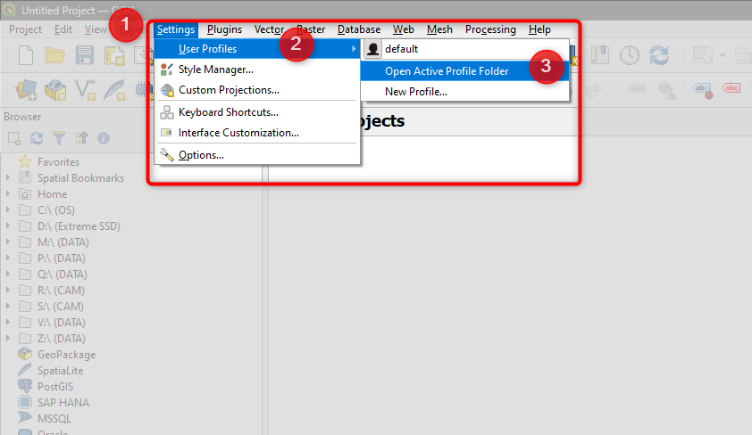

git.. Purpose: This chapter aims to describe how the user starts to use QGIS. It
.. should be kept short with only few steps to get QGIS working with two layers.

***************
Getting Started
***************

.. only:: html

   .. contents::
      :local:

This chapter provides a quick overview of installing and configuring QGIS. 

On any PCA workstation, you will find an updated version of QGIS (if you need to install the software on a new computer, you can refer to our IT department or to our Geospatial Data department for support).

Whether you are using a pre-installed version of QGIS or installing a new version from scratch, it is very important to know how QGIS versions work. 

QGIS is a very prolific software with frequent updates and new version releases (every 4 months). This allows the developers to provide the community with constant support, introducing new features and fixing bugs and issues in short time. 

This means that in a single year, 5 different versions of QGIS are available for download, but only one of them will be labelled as LTR (Longe Term Release), which is the suggested version for business use and that guarantees a more extended continuity of features and tools along all the year, without big changes.

Furthermore, PCA's current QGIS workflow makes extensive use of add-ons and plugins specifically developed for our integrated DRS/GIS system.
For the functionality of each plugin to be guaranteed, it is important that all workstations use a version of QGIS previously tested by the Geospatial data department.

For these reasons, it is essential that all the workstations are using the same QGIS LTR version and that each update is previously authorized by the geospatial data team.

Currently, the version used is the :guilabel:`3.22.10-1` (that will be soon replaced by the 3.28.8) 

Installing QGIS
===============

As just described, several versions of QGIS exist simultaneously and, often, the one currently chosen as the one to be used in our company is no longer among the versions available for download on the official software site.

On the understanding that the management of QGIS versions in corporate workstations is the responsibility of IT departments or geospatial data, to which reference can be made for any request for help, if, for a specific reason, you need to install a copy of QGIS in your own workstation, you can access to the current installation files in our server at the address :guilabel:`Z:\\GeoSpatialData_Resources\\QGIS_Resources\\Current_QGIS_Installer`

....

Configuring QGIS
===============

Adding the PCA custom Profile
~~~~~~~~~~~~~~~~~~~~~~~~~~~~~~~~~~

QGIS offers great flexibility for customization. To ensure that all the company workstations have the same basic QGIS configuration and access to the PCA Plugin Repository, it is possible to add a custom QGIS profile to your workstation.
The procedure is quite simple and requires only copying a prepared folder into your QGIS configuration folder.

~ ~ ~ ~ ~
On Windows, the QGIS profile folder is located at *C:\Users\your_username\AppData\Roaming\QGIS\QGIS3\profiles*
Is also possible to access it directly by QGIS.
Open QGIS

1. In the Menu Bar select :guilabel:'Settings'
2. Choose :guilabel:'User Profiles'
3. Click on :guilabel:'Open Active Profile Folder'

This will open a File Explorer. In this new window, navigate one level down to Profiles [4]: this is where the custom QGIS Profile folder must be copied.

Open another Windows File Explorer and navigate to Z:\GeoSpatialData_Resources\QGIS_Resources\QGIS Profile. Here, you will find the folder PCA_QGIS_profile.

Copy and paste this folder into your QGIS Profiles folder.

The new QGIS profile will be now available.
Reopen QGIS. In the Menu Bar reselect :guilabel:'Settings' → :guilabel:'User Profiles'
Click on the :guilabel:'PCA_QGIS_Profile'

This will start a new QGIS session with the PCA customised profile settings and configurations.

Close the previous QGIS session with the older profile and start using the new PCA Profile.

QGIS keeps in memory which profile was in use in the last session and reuses it at any new launch. From now on, QGIS will start using the custom PCA profile.
As a final step, after this procedure, it is a good habit to check for Plugin updates to ensure you are using the last version of our PCA QGIS tools.

.. attention:: Since the QGIS configuration folders are saved within your own profile, this operation will need to be repeated every time you first access your profile on a new workstation.

For your information, the customised options are:

Coordinate system

PCA plugin repository

Suggested basic interface configuration

